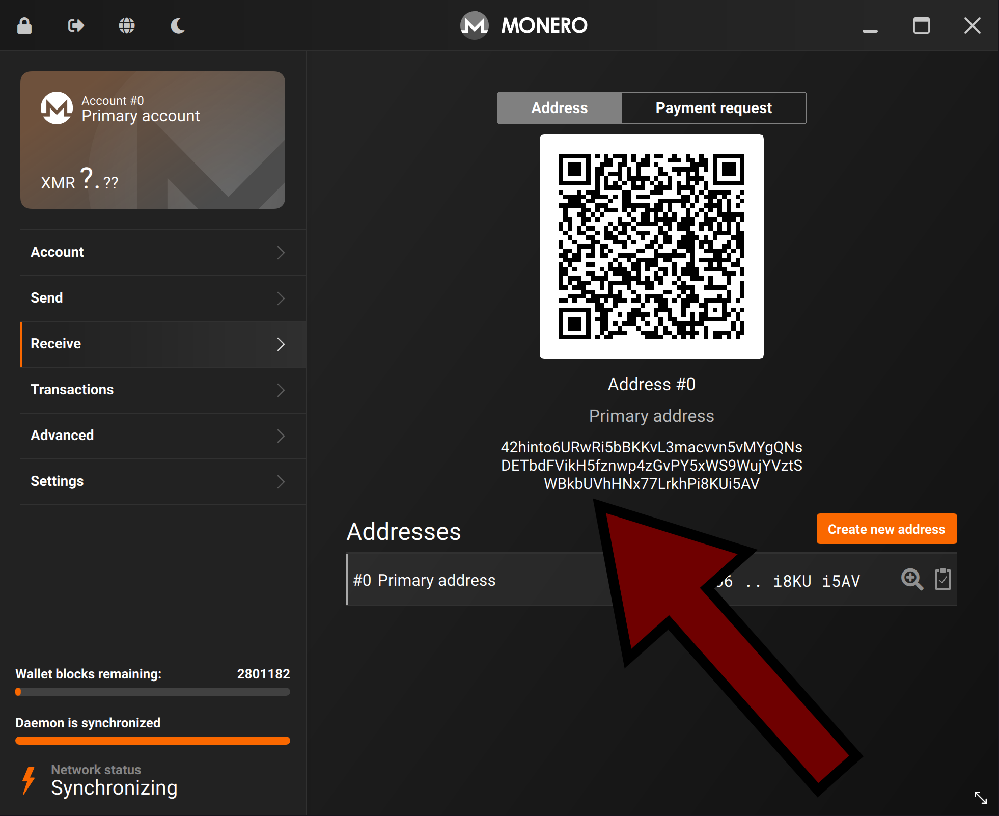

<div align="center">

# monero-vanity
monero-vanity is a GUI/CLI tool that generates vanity addresses for Monero, like this one:
</div>

```
44hintoFpuo3ugKfcqJvh5BmrsTRpnTasJmetKC4VXCt6QDtbHVuixdTtsm6Ptp7Y8haXnJ6j8Gj2dra8CKy5ewz7Vi9CYW
```

<div align="center">

#### GUI

https://user-images.githubusercontent.com/101352116/229327381-2b001b8a-b1a0-4889-93d2-ce6a9c2a858f.mp4

#### CLI

https://user-images.githubusercontent.com/101352116/229327380-52a7f8a2-fcf7-4eb0-9ec8-c0554f86a2bc.mp4

</div>

---

* [Comparison](#Comparison)
* [Estimate](#Estimate)
* [GUI Usage](#GUI-Usage)
* [CLI Usage](#CLI-Usage)
* [Install](#Install)
* [Implementation](#Implementation)
* [Build](#Build)
* [Warning](#Warning)

---

## Comparison
*Tested with: Ryzen 5950x, GTX 1660 Ti*

| Generator                                                           | Hardware needed        | Regex | Calculates seed | Normal speed     | Regex speed |
|---------------------------------------------------------------------|------------------------|-------|-----------------|------------------|-------------|
| [vanity-monero](https://github.com/monero-ecosystem/vanity-monero)  | CPU (x86, 32/64-bit)   | Yes   | Yes             | 400k/sec         | 170k/sec
| **[monero-vanity](https://github.com/hinto-janai/monero-vanity)**   | CPU (x86, 64-bit)      | Yes   | No              | 72 million/sec   | 72 million/sec
| [vanity-xmr-cuda](https://github.com/SChernykh/vanity_xmr_cuda)     | NVIDIA GPU (with CUDA) | No    | No              | 8.1 million/sec  |

The speed comes from:
- Batched `EdwardsPoint` operations
- Only encoding the first `11` bytes of the Monero address.

This means that you _cannot_ search for anything past `11` characters, e.g:
```
44hintoFpuo3ug...
          ^
----------|
The last character that will be looked at

'3ug' onward is ignored.
```

This is fine since you (probably) want the identifier to be near the front.

Anything past 8 characters is also unrealistic, see below:

## Estimate
| Characters | Example          | Rough Time Estimate   |
|------------|------------------|-----------------------|
| 1          | `44h`            | Instant               |
| 2          | `44hi`           | Instant               |
| 3          | `44hin`          | Instant               |
| 4          | `44hint`         | Instant               |
| 5          | `44hinto`        | 8 seconds             |
| 6          | `44hintoj`       | 7 minutes, 30 seconds |
| 7          | `44hintoja`      | 2 hours, 45 minutes   |
| 8          | `44hintojan`     | 23 days               |
| 9          | `44hintojana`    | 5 years, 4 months     |
| 10         | `44hintojanai`   | 253 years             |
| 11         | `44hintojanaiy`  | 8,124 years           |
| 12         | `44hintojanaiyo` | Pretty much never     |

*Assuming speed of 72 million keys a second*

## GUI Usage
<div align="center">

After finding an address, create a new Monero wallet:


Input the address, private view key, and private spend key:


And verify your new wallet address is correct:



</div>

## CLI Usage
```bash
Usage: monero-vanity [--OPTIONS]

Options:
  -t, --threads <THREADS>  How many threads to use [default: HALF_THREADS]
  -p, --pattern <PATTERN>  Address regex pattern to look for
  -f, --first              Start from 1st character instead of: ^4.PATTERN.*$
  -r, --refresh <REFRESH>  How many milliseconds in-between output refreshes [default: 500]
  -v, --version            Print version
  -h, --help               Print help (see more with '--help')
```
Example 1 - Basic pattern using half threads:
```bash
./monero-vanity --pattern hinto

> 44hinto...
```

Example 2 - Advanced regex pattern using half threads:
```bash
./monero-vanity --first --pattern "^4(4|8)h(i|1)nto.*$"

> 48hinto...
```

After finding the private spend key:
```
./monero-wallet-cli --generate-from-spend-key YOUR_WALLET_NAME
```
Enter the private key and the generated wallet will have the address found.

**Notes:**
- [Rust regex is allowed in any mode](https://docs.rs/regex/latest/regex/#syntax)
- All characters must be ASCII, Unicode, or a regex pattern
- `I`, `O`, `l`, `0`, `+`, `/` are invalid characters in [Monero addresses](https://monerodocs.org/cryptography/base58)
- Using slightly less than max threads might be faster

`monero-vanity` automatically prefixes your input with `^4.` and suffixes it with `.*$` so that your PATTERN starts from the 3rd character until the 11th character of the address.

Example input: `hinto`  
Actual regex used: `^4.hinto.*$`

To disable this, use `--first`.

Warning: this puts you in full control of the regex, you can input any value, even an impossible one.

## Install
Download [here.](https://github.com/hinto-janai/monero-vanity/releases)

<!--### Cargo-->
<!--If you have `cargo`, you can install with:-->
<!--```bash-->
<!--cargo install monero-vanity-->
<!--```-->
<!---->
### Arch
If you're using Arch Linux, you can install from the [AUR](https://aur.archlinux.org/packages/monero-vanity-bin) with:
```bash
paru monero-vanity
```

## Implementation
1. [Random `[u8; 64]` is generated (512 bits/64 bytes)](https://github.com/hinto-janai/monero-vanity/blob/43d0dbedb23bbe157ea76704e848d4708531ff5e/src/address.rs#L69)
2. [Scalar is created by reducing the above bytes](https://github.com/hinto-janai/monero-vanity/blob/43d0dbedb23bbe157ea76704e848d4708531ff5e/src/address.rs#L53)
3. [10,000 `EdwardsPoint`'s are created with += 1 offsetting](https://github.com/hinto-janai/monero-vanity/blob/43d0dbedb23bbe157ea76704e848d4708531ff5e/src/address.rs#L81)
4. [EdwardsPoint are batch compressed into Y points](https://github.com/hinto-janai/monero-vanity/blob/43d0dbedb23bbe157ea76704e848d4708531ff5e/src/address.rs#L87)
5. [Mainnet byte and first 10 CompressedEdwardsY bytes are concatted](https://github.com/hinto-janai/monero-vanity/blob/43d0dbedb23bbe157ea76704e848d4708531ff5e/src/address.rs#L91)
6. [Those 11 bytes are encoded in base58](https://github.com/hinto-janai/monero-vanity/blob/43d0dbedb23bbe157ea76704e848d4708531ff5e/src/address.rs#L107)
7. [If regex matches, create full address and return to user, else...](https://github.com/hinto-janai/monero-vanity/blob/43d0dbedb23bbe157ea76704e848d4708531ff5e/src/address.rs#L109)
8. [Continue, either with next point or next batch](https://github.com/hinto-janai/monero-vanity/blob/43d0dbedb23bbe157ea76704e848d4708531ff5e/src/address.rs#L130)

**Notes:**
- [Each thread seeds its own RNG](https://github.com/hinto-janai/monero-vanity/blob/43d0dbedb23bbe157ea76704e848d4708531ff5e/src/address.rs#L68)
- The (optional) private _view_ key is also created by reducing [512 random bits](https://github.com/hinto-janai/monero-vanity/blob/43d0dbedb23bbe157ea76704e848d4708531ff5e/src/address.rs#L118)

## Build
```
git clone --recursive https://github.com/hinto-janai/monero-vanity
cargo build --release
```
Optimized for your specific CPU (up to 15%~ speed increase):
```
RUSTFLAGS="-C target-cpu=native" cargo build --release
```

## Warning
I am not a cryptographer, nor was this code audited.

Use this program at your own risk.
